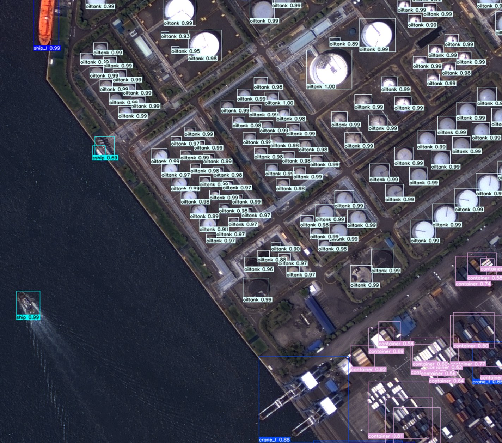

# KARI 객체탐지 모델 (kari-det)


한국항공우주연구원(KARI) 국가위성활용지원센터 AI Lab, 2023.

## Docker 빌드
```
docker build --tag kari-det:latest .
```
이 과정은 시간이 걸릴 수 있습니다. 소스코드는 자동으로 /kari-det에 설치가 됩니다.

## Docker 실행
다음 명령어를 실행해서 GPU 사용, 공유 메모리 설정, 데이터가 놓일 디렉토리에 대한 볼륨 마운트 설정을 합니다.

```
docker run --gpus all -it --shm-size 4g --rm -v images:/kari-det/images:ro kari-det:latest bash
```

## Inference (storage detection)
도커 환경내에서 다음 명령어로 'kari-det' Conda 환경을 활성화합니다.

```
conda activate kari-det
```
```
cd kari-det
```
프로그램을 처음 실행하는 경우, 다음 명령어를 실행합니다.

```
pip install -e .
```
아리랑 위성영상에 대해 추론하기 위해서는 입력영상이 있는 디렉토리를 지정하여 다음과 같이 실행합니다. (정유 탱크 탐지의 예)

```
./kari-det_oil_tanks.sh /kari-det/images
```
특정 클래스 외에 모든 클래스에 대해 추론하는 경우, 다음의 명령어를 실행합니다.
```
./kari-det predict model=./weights/kari-det.pt source=/kari-det/images imgsz=1024 save=True max_det=1000
```

본 모델은 Ultralytics사의 YOLOv8 모델을 기반으로 작성되었습니다.
학습된 weight 파일은 다음 URL에서 다운 받으실 수 있습니다.
https://karidrive.kari.re.kr/aaabbbb/
본 모델과 관련하여 질문이 있는 경우 다음의 이메일 주소로 연락바랍니다. 
오한 (ohhan@kari.re.kr)
